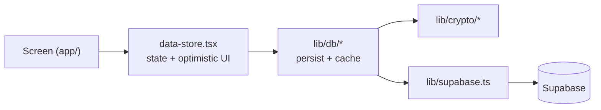

# CLAUDE.md — Aight Bet

Zero-knowledge, end-to-end-encrypted habit + journal app. Solo founder, ~7 hrs/week, shipping to TestFlight. For the product vision (analytics, per-habit deep-dive, privacy-first AI), see `PRODUCT.md`. For the schema + crypto model, see `docs/DATABASE.md`.

## The two laws (read first, every session)

1. **`tasks.md` is law.** Do the top unchecked item under "NEXT SESSION STARTS HERE." One milestone in flight, ever. Anything off-milestone — new features, refactors, design polish, "while I'm here" fixes — goes to the **Nice-to-haves** list as one line. Don't build it. Polish is post-beta.

2. **Never rename the `banana:*` constants.** AAD prefixes (`banana:v1:*` in `lib/crypto/payload.ts`), the SecureStore key `banana_mk_v1`, and AsyncStorage keys `banana_*_v2`. They seal every existing ciphertext and key local caches — renaming breaks decryption of all existing data. The app brands as "Aight Bet"; the wire protocol stays "banana." Intentional, commented at each site.

## Stack

- **Expo SDK 54** · React Native 0.81.5 · **React 19.1**
  - React Compiler is **ON** (`app.json` → `experiments.reactCompiler`). Don't hand-add `useMemo` / `useCallback` / `memo` for performance — leave existing memoization alone.
- **expo-router v6** — file-based routing under `app/`, typed routes ON. Groups: `(tabs)`, `auth/`, `onboarding/`.
- **TypeScript ~5.9, `strict`** — path alias `@/*` → repo root. No `any`. No non-null `!` on crypto/session values — branch instead.
- **Supabase** is the entire backend — Postgres + RLS + Storage. No custom server; RLS policies + migrations (`supabase/migrations/`) *are* the backend.
- **Crypto** — `@noble/ciphers` (AES-GCM) + `@noble/hashes` (scrypt, HMAC-SHA256), all in `lib/crypto/`.
- **Fonts** — ShantellSans handwriting. **Storage** — AsyncStorage (cache) + expo-secure-store (master key).

## Commands

```bash
npm start            # dev server (then i / a / w)
npm run ios          # iOS simulator
npm run lint         # MUST pass clean before "done"
npx tsc --noEmit     # MUST pass clean before "done"

npx tsx tests/crypto.test.ts       # pure crypto units (no network)
npx tsx tests/e2e.test.ts          # integration vs live Supabase (needs .env)
npx tsx tests/benchmark.test.ts    # crypto perf numbers
```

Tests use a custom harness (`tests/helpers.ts`), not Jest — each file self-invokes `run()`. **The gate before declaring anything done: `npm run lint` + `npx tsc --noEmit`, both clean.**

## Layout

```
app/            expo-router screens — (tabs)/ index=tracker, feed, profile · auth/ · onboarding/
components/     shared components; components/ui/ = primitives (paper-card, pressable-scale, …)
constants/      theme.ts (Colors, Fonts), motion.ts (Motion) — the ONLY source of colors/fonts/timing
lib/crypto/     E2E primitives — keyring (key lifecycle), payload (encrypt/decrypt + AAD), buckets (HMAC dates)
lib/db/         data layer (entries, habits, habit-logs) — Map + AsyncStorage + Supabase per file
lib/            data-store.tsx (DataProvider), auth-context.tsx, supabase.ts, media/, auth/
supabase/migrations/   SQL schema + RLS — the backend
tests/          tsx harness · docs/ — DATABASE.md, privacy-policy.md
```

## The layers — never cross them



- Screens render + wire state + call the store. They **never** import `supabase` or `lib/crypto` directly.
- `data-store.tsx` owns React state and optimistic updates.
- `lib/db/*` owns persistence, caching, and crypto calls.
- `lib/crypto/` is the only place that imports `@noble/*` or touches the master key.

## Security — non-negotiable

This is a zero-knowledge app; the threat model includes our own server admin.

- **Master key** never leaves the device, never gets logged, never serialized anywhere but expo-secure-store. The server stores only wrapped blobs, KDF params, and ciphertext. About to send plaintext or a raw key to Supabase? Stop — that breaks the product.
- **AAD is mandatory.** Every `encryptJson` / `decryptJson` / `encryptBytes` / `decryptBytes` passes an `aad` from the `AAD` builders in `lib/crypto/payload.ts`. A new encrypted type means a new `AAD.<type>()` with the `banana:v1:` prefix — never an ad-hoc string, never skip it. No raw `aesEncrypt` without AAD outside `primitives.ts`.
- **Queries go through the query builder** (`.eq()`, `.select()`, `.upsert()`) — never string-built SQL. Every `SECURITY DEFINER` function sets `search_path`, revokes from `public`, then grants narrowly (see `username_available`).
- **RLS is the access boundary.** Every table is owner-scoped (`owner_id = auth.uid()` or `id = auth.uid()`). A new table ships with RLS enabled + owner-only policies in the same migration. Never disable RLS.
- **DTO discipline.** `.select()` only the columns you need, and map rows to app shapes (`DailyEntry`, `ProfileData`) before they reach the UI. Never spread a raw row into state; never widen a select "just in case."
- **Secrets.** Only `EXPO_PUBLIC_*` vars reach the client (the anon key is public by design). The service-role key never appears in app code or a committed `.env`. No `console.log` of keys, tokens, ciphertext, or payloads — gate debug logs behind `if (__DEV__)`, and even then never log secret material.
- **Validate at the boundary** before encrypt/insert — usernames against `UsernameRules`, recovery keys via `normalizeRecoveryKey`.
- **Photos are outside the zero-knowledge promise** — decided 2026-08-20, not a "not yet". They live in a private bucket (RLS + at-rest only), so we *could* technically read them; the app and the privacy policy both say exactly that. Encrypting them would mean downloading and decrypting every image before it renders, which rules out signed URLs and CDN caching — a real cost, not a small one. Never describe photos as end-to-end encrypted, and never soften it to "coming soon". Reversing this needs a `tasks.md` item.

## Architecture guardrails

Keep velocity high and bloat zero.

- **Reuse before you write** — card → `PaperCard`; tappable → `PressableScale` / `IconButton`; loading → `Skeleton`; colors/fonts → `constants/theme.ts`; timing/springs → `constants/motion.ts`; dates → `DateFormats`. Never hardcode a hex, font string, or duration.
- **The cache pattern is fixed** — in-memory `Map` (sync) → AsyncStorage (offline) → Supabase (network), keyed `userId:YYYY-MM`. New persisted data copies the entries/habits/habit-logs shape exactly. No second caching strategy.
- **Optimistic UI** — local update first (`updateEntry` / `updateHabitLog`), then persist. Reads short-circuit on cache unless `force: true` (pull-to-refresh).
- **Stay small** — files focused, matching the surrounding comment density and naming. Prefer editing an existing module over adding one. No new dependency without a clear reason; the stack above is complete for v1.

## Path-scoped rules (auto-loaded by directory)

- `.claude/rules/frontend.md` — `app/`, `components/`, `constants/`
- `.claude/rules/backend.md` — `lib/`, `supabase/`
