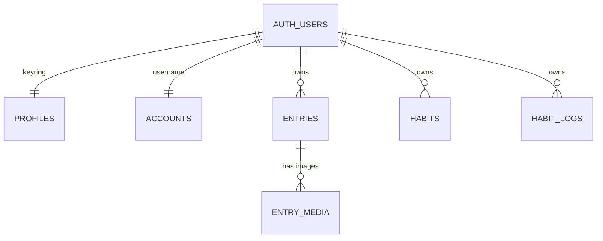
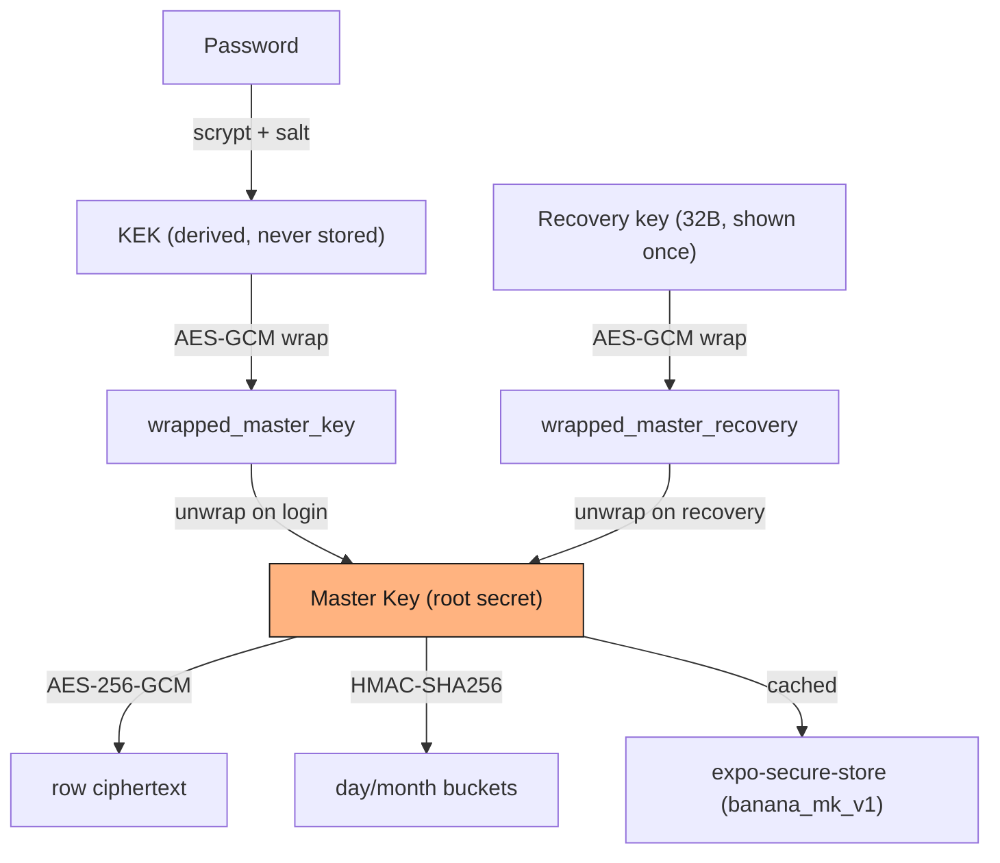
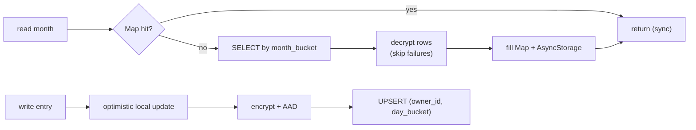

# Database & Encryption — Aight Bet

The backend is **Supabase only**: Postgres + Row Level Security + Storage. There
is no app server. The phone is the only trusted party — the server is assumed
hostile (the threat model includes our own DB admin), so everything sensitive is
encrypted on-device before it's sent.

**Source of truth:** `supabase/migrations/*.sql` and `lib/crypto/*`. This doc
explains them; the code wins if they disagree.

---

## Principles

- **Zero-knowledge** — server stores only wrapped keys, KDF params, and
  ciphertext. It can't read journal text, habit names, or real dates.
- **Master key never leaves the device** — generated client-side, persisted only
  to `expo-secure-store`, never logged, never sent to Supabase.
- **RLS is the access boundary** — every table is owner-scoped to `auth.uid()`.
- **Dates are hidden** — the server queries by `day_bucket` / `month_bucket` =
  HMAC(masterKey, date), so it can group by day/month without learning the date.
- **Photos are NOT E2E-encrypted in v1** (disclosed). Image bytes are encrypted
  in Storage, but don't over-claim this path.

---

## Schema overview

All six tables hang off Supabase's `auth.users`. Deleting a user cascades to
everything.



**Shared conventions** (every table):

- `id uuid` primary key, RLS **enabled**, owner-scoped to `auth.uid()`.
- Data tables also have `owner_id`, `ciphertext`, `nonce`, `version`, plus
  `created_at` / `updated_at` (auto-maintained by a trigger).

| Table | Purpose | Encrypted? | Key columns / constraints |
|-------|---------|-----------|---------------------------|
| `profiles` | The keyring — wrapped master key + KDF params (see below) | wrapped blobs | `id` = user. **No delete policy** (can't self-brick). |
| `accounts` | Public username (uniqueness + future social) | **plaintext, by design** | `username` unique, `^[a-z0-9_]{3,20}$`, lowercase. **No delete policy.** |
| `entries` | One journal entry per day | yes | unique `(owner_id, day_bucket)`; index `(owner_id, month_bucket)` |
| `entry_media` | Pointers to encrypted images in Storage | meta encrypted | FK → `entries`; `ciphertext_meta` holds the per-media data key; unique `object_path` |
| `habits` | Habit definitions (name) | yes | index `(owner_id)` |
| `habit_logs` | Daily completions | yes | unique `(owner_id, day_bucket)`; index `(owner_id, month_bucket)` |

**Decrypted payload shapes** (`lib/db/types.ts`):

- `entries` → `{ date, entries: [{ id, text, createdAt, mediaPaths? }] }`
- `habits` → `{ id, name, createdAt }`
- `habit_logs` → `{ habitId, date, completed }` — note the habit id and date live
  *inside* the ciphertext; only the HMAC bucket is server-visible.

---

## Encryption model

Three key layers, each protecting the one below it:



- **Two unlock paths** — password *or* recovery key — because the master key is
  wrapped twice. The recovery key is also stored encrypted-with-the-master-key
  (`recovery_key_display`) so it can be re-viewed in Settings.
- **`profiles` columns:** `wrapped_master_key(+_nonce)`, `kdf_salt`,
  `kdf_params (jsonb)`, `wrapped_master_recovery(+_nonce)`,
  `recovery_key_display(+_nonce)`, `recovery_key_hint`, `recovery_key_created_at`.

**Primitives** (`lib/crypto/primitives.ts`):

| Use | Algorithm | Params |
|-----|-----------|--------|
| Encryption | AES-256-GCM | 256-bit key, 96-bit nonce |
| Password KDF | scrypt | `N=16384, r=8, p=1, dkLen=32` (~1–2s on iPhone) |
| Buckets / MAC | HMAC-SHA256 | truncated to 32 hex chars |

**Keyring lifecycle** (`lib/crypto/keyring.ts`): `setupNewUser` (signup) →
`unlock` (login) → `tryRestoreFromCache` (restart) →
`unlockWithRecoveryKey` + `setPassword` (recovery) → `lock` (logout, zeroizes
memory + wipes SecureStore). KEK and recovery bytes are always zeroized in
`finally`.

---

## Date buckets (`lib/crypto/buckets.ts`)

Deterministic, opaque, per-user HMAC pseudonyms — same date always maps to the
same bucket (so unique constraints + month queries work), but the bucket reveals
nothing without the master key.

```
day_bucket   = HMAC(masterKey, "day:YYYY-MM-DD")[:32]
month_bucket = HMAC(masterKey, "month:YYYY-MM")[:32]
habitlog     = HMAC(masterKey, "habitlog:<habitId>:<date>")
```

---

## AAD — binding ciphertext to context (`lib/crypto/payload.ts`)

AES-GCM authenticates the AAD: if it doesn't match at decrypt time, decryption
fails. This stops a hostile server moving a valid blob to another row/day/user.

| Builder | AAD string |
|---------|-----------|
| `AAD.entry(dayBucket, ownerId)` | `banana:v1:entry:<dayBucket>:<ownerId>` |
| `AAD.habit(ownerId)` | `banana:v1:habit:<ownerId>` |
| `AAD.habitLog(dayBucket, ownerId)` | `banana:v1:habitlog:<dayBucket>:<ownerId>` |
| `AAD.wrapMaster(userId)` | `banana:v1:wrap:master:<userId>` |
| `AAD.wrapRecovery(userId)` | `banana:v1:wrap:recovery:<userId>` |
| `AAD.recoveryDisplay(userId)` | `banana:v1:recovery_display:<userId>` |

> **`banana:*` is a protocol constant, not branding.** These strings sealed every
> existing ciphertext — renaming any of them breaks all decryption. Same for the
> SecureStore key `banana_mk_v1` and AsyncStorage keys `banana_*_v2`. New record
> types get a *new* `banana:v1:` builder; never inline a string, never skip AAD.

---

## RPCs, Storage, deletion

- **`username_available(text) → boolean`** — signup checks availability before an
  account exists, without leaking the user list. `SECURITY DEFINER`,
  `search_path = ''`, granted to `anon` + `authenticated`.
- **`delete_my_account() → void`** — deletes the `auth.users` row; all `public.*`
  tables cascade off it. `SECURITY DEFINER`, `authenticated` only.
- **Storage:** one private bucket `private-media`, path `{uid}/{entry_id}/{media_id}.bin`.
  Every policy is scoped by `name like auth.uid() || '/%'`. Images served as
  signed URLs via `lib/media/storage.getImageUrl()`.
- **Account deletion is two steps:** the client clears Storage objects under
  `{uid}/...` first (Supabase blocks server-side storage deletes), *then* calls
  `delete_my_account()`. See `app/(tabs)/profile.tsx`.

---

## Read / write flow

The same cache pattern across every `lib/db/*` module: **in-memory `Map` (sync) →
AsyncStorage (offline) → Supabase (network)**, keyed `userId:YYYY-MM`. Writes are
optimistic (local first, then persist). A corrupt row is skipped, never blanks
the screen.



---

## Migrations

Timestamped, idempotent, `begin; … commit;`. Never edit an applied one — append.

| File | What it did |
|------|-------------|
| `…120000_initial_setup` | All 6 tables, triggers, RLS, `username_available`, `private-media` bucket. |
| `…130000_account_deletion` | `delete_my_account()` RPC. |
| `…160000_fixes_v1` | `bytea` → `text` for ciphertext/nonce (base64, not hex); dropped `delete` policies on profiles/accounts; hardened RPC `search_path`. |
| `…170000_fixes_v2` | Moved storage cleanup client-side (Supabase blocks it in the RPC). |
